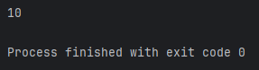
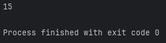
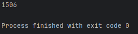
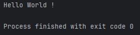
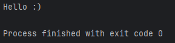
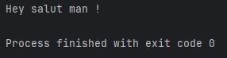
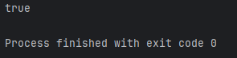
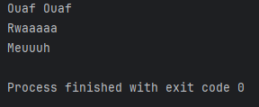

**Les Fonctions en Java**
=============
_Difficultée: 4 / 10 🟡_

-------------

_Dans ce chapitre, nous allons découvrir **qu'est-ce qu'une fonction** en Java, **comment les écrire** et **comment bien s'en servir**._

**C'est Quoi une Fonction ? 🤔**
-------------

-> Par définition, une fonction est un **bloc de code réutilisable** qui exécute une tâche spécifique.

_Plus simplement, c'est une sorte de **raccourci** pour tout bon développeur qui se respecte._

-------------

-> Une fonction est un terme général, mais il est possible de l'appeler différement: 

- **Une Méthode** : _Retourne **obligatoirement une valeur** à la fin de cette dernière_.
- **Une Procédure** : _Exécute **simplement du code** sans un réel retournement de valeur_.

-------------

**Comment on écrit des fonctions alors ? 🤔**
-------------

-> Avant de coder une fonction, **posons-nous une question**: _"Quel type de valeur dois-je récupérer avec la fonction ? Un Int ? Un Booléen ? Un String ? Rien ?"._

**Contexte:** Pour notre exemple, nous voulons simplement faire une addition à l'aide de fonction, nous voulons donc récupérer une valeur de type "Int", restons simple.

-------------

Tout d'abord, définissez si votre fonction sera "**public**", "**private**" ou "**protected**", pour l'exemple on définira une fonction **publique**. Je commence donc par écrire "**public**".

``` java
public
```

Ensuite, renseignez le **type de valeur que vous voulez récupérer**. Ici, je choisis "int" car je veux récupérer **un entier**.

``` java
public int
```

Poursuivons notre fonction en écrivant le nom de cette dernière, étant donné que notre exemple est une simple addition, renseignons cela.

``` java
public int addition() {

}
```
_Puis je termine par des paranthèses collées au nom de notre fonction avec des accolades pour ouvrir et fermer notre fonction, **là où nous écrirons notre code** tout comme le chapitre sur Les Conditions._

-------------

**🔴 Il est très important de noter que si vous mettez autre chose que "void" dans le type de votre fonction (ici int), vous devrez forcément retourner une valeur de ce type.**

-------------

-> Reprenons notre fonction et ajoutons donc un "**return**" suivi une valeur dite "**int**" car comme mon **type de fonction est "int"** il me faut donc **retourner une valeur de ce type.**

``` java
public int addition() {
    return 10;
}
```
On oublie évidemment pas le point-virgule.

-> Dans ce cas présent, si je décide d'utiliser ma fonction dans un calcul ou un affichage, ça m'affichera "10" **car je retourne cette valeur.**

``` java
public int addition() {
    return 10;
}

System.out.println(addition());
```
Résultat dans la console:



Il m'affiche bien 10.

-------------

Il y a quelque chose d'important à savoir sur les fonctions. **Vous pouvez lui ajouter des paramètres !**
Les paramètres d’une fonction en Java sont des **valeurs d’entrée** passées à la méthode pour qu’elle **puisse effectuer son traitement**. Ils permettent de rendre une méthode **plus flexible et réutilisable.**

Pour cela, revenons dans nos paranthèses de notre fonction et donnons lui un paramètre qu'on appellera "a" pour le premier élément à additionner et un autre "b" pour terminer l'addition, tout les deux de type "int".

``` java
public int addition(int a, int b) {
    return 10;
}

System.out.println(addition(10, 5));
```
On commence d'abord par écrire **le type de paramètre**, puis **son nom**, et on peut en rajouter **autant que nous voulons** à condition qu'ils soient séparés par une **virgule**, comme ci-dessus.

-> Bien sûr, si vous ajoutez un paramètre à votre fonction, lors de l'appel de cette dernière **vous devez aussi les renseigner**, ici, il n'est pas nécessaire de renseigner le type de valeurs, mais il faut les séparer par une virgule.

Lors de l'affichage, cela nous affichera encore 10, car nous retournons toujours la valeur "10", nos paramètres ne servent donc à rien actuellement, réglons ça !

-------------

``` java
public int addition(int a, int b) {
    return a + b;
}

System.out.println(addition(10, 5));
```
Je ne retourne plus "10" mais la valeur de "a + b", lors de notre appel de fonction dans le System.out.println(), nos renseignons que **a = 10 et b = 5**, logiquement, il devrait m'afficher le résultat de **10 + 5**:

Résultat dans la console:



-> On peut voir que ça marche bien, il m'affiche bien le résultat **des deux paramètres que j'ai entré lors de l'appel de ma fonction**, prenons maintenant un autre exemple, cette fois avec **a = 1500 et b = 6**:

``` java
public int addition(int a, int b) {
    return a + b;
}

System.out.println(addition(1500, 6));
```
Résultat dans la console:



-> Voilà, le résultat de notre opération est bien 1500 + 6 = 1506.

-------------
Nous venons de faire une fonction retournant une opération, maintenant, essayons de ne **retourner aucune valeur** et de simplement afficher "Hello World !" avec une nouvelle fonction.

``` java
public void hello() {
    System.out.println("Hello World !");
}

hello();
```
Résultat dans la console:



-> Utilisez le **type de fonction "void"** si vous ne voulez pas **retourner de valeur**.

-------------

Essayons maintenant de faire la même chose mais cette fois en retournant une valeur **"String"** soit une chaîne de caractère. Pour cela, nous n'utiliserons pas "int" ni "void" comme type de fonction mais bien **"String"**:

``` java
public String hello() {
    return "Hello :)";
}

System.out.println(hello());
```
Résultat dans la console:



-> Je place ma fonction "hello()" dans un System.out.println() pour **l'afficher** car elle retourne **seulement une valeur** mais ne l'affiche pas d'elle même.
Maintenant essayons d'aller un peu plus loin..

-------------

Codons une fonction qui affiche la chaîne de caractère entrée en paramètre lors de son appel, je renseigne donc "String text" dans les paranthèses de ma fonction pour indiquer que pour appeler cette fonction, il faudra y renseigner une chaîne de caractère, qui sera ensuite affichée:

``` java
public String text(String text) {
    return text;
}

System.out.println(text("Hey salut man !"));
```
Résultat dans la console:



-------------

Nous pouvons également faire des fonctions retournant des **valeurs booléennes**.
Exemple: Je veux créer une fonction qui me retourne "Vrai" si je suis majeur, si je ne le suis pas, elle me retourne "Faux".

``` java
public boolean isAdult(int age) {
    if (age >= 18) {
        return true;
    } else return false; 
}

System.out.println(isAdult(18));
```
Résultat dans la console:



-> J'entre en paramètre de ma fonction booléenne une valeur entière qui **correspondrait à l'âge de la personne** (car un âge c'est rarement à virgule).

-> Ensuite, je vérifie à l'aide d'une condition si **l'âge que j'ai rentré lors de l'appel de la fonction est supérieur OU égal à 18**, si oui, ma fonction sera vraie, sinon elle sera fausse.

Il est possible **d'optimiser nos conditions**, même dans des fonctions pour rendre notre code plus lisible, notre fonction ci-dessus est **exactement la même** que les trois du dessous:

``` java
public boolean isAdult(int age) {
    if (age >= 18) return true;        // Il n'est pas nécéssaire de garder les accolades dans des conditions lorsque l'instruction qui vient est solitaire.
    else return false; 
}

public boolean isAdult(int age) {
    return age >= 18 ? true : false;        // Il n'est pas nécéssaire de faire de condition sous forme de "if" "else", ici, vous retourner "true" si la valeur d'âge est supérieure ou égale à 18 sinon "false".
}

public boolean isAdult(int age) {
    return age >= 18;        // Il n'est pas nécéssaire de faire de condition, une fonction booléenne n'a que deux valeurs : vrai ou faux. Ici on retourne la VALEUR de "age >= 18", si elle est vraie alors notre fonction                                // le sera tout autant, sinon notre fonction sera fausse.
}
```

-------------

Prenons maintenant un dernier exemple qui ira encore plus loin.

Exemple: Je veux créer une fonction qui me retourne l'onomatopé d'un bruit d'animal qu'on rentrera à l'appel de la fonction.

Comment faire ?

-> Utilisons **"String"** comme retournement de valeur car nous voulons une chaîne de caractère, j'écris donc ma fonction:

``` java
public String animalSound(String animal) {        // Il faudra rentrer en chaîne de caractère le nom d'un animal.
    String sound = "";                            // Je crée une variable de type "String" qui ne contient rien encore.

    switch (animal) {                             // Je crée un switch pour assigner la variable "sound" à quelque chose en fonction de ce que renseigne l'utilisateur à l'appel de la fonction.
        case "Chien" -> sound = "Ouaf Ouaf";
        case "Chat" -> sound = "Miaou";
        case "Lion" -> sound = "Rwaaaaa";         // Je regarde si le paramètre de la fonction est un "Lion", si c'est le cas j'assigne à "sound" son cri donc "Griii".
        case "Tigre" -> sound = "Griii";
        case "Vache" -> sound = "Meuuuh";
    }

    return sound;                                 // Je retourne la variable "sound" qui aura donc une valeur en fonction de ce que rentre l'utilisateur comme valeur à l'appel.
}

System.out.println(animalSound("Chien"));         // J'affiche le résultat de la fonction car elle n'affiche rien d'elle même mais donne juste une valeur.
System.out.println(animalSound("Lion"));
System.out.println(animalSound("Vache"));
```
Résultat dans la console:




-------------

Pour plus d'informations, visionnez cette vidéo:  [APPRENDRE LE JAVA #6 - LES FONCTIONS](https://www.youtube.com/watch?v=rJx9Q-aYuAA)

-------------

Voilà, vous avez appris à créer une **fonction** qu'elle soit simple ou complexe, entraînez-vous jusqu'à ce que vous maîtrisiez ces dernières pour faire des fonctions encore plus fascinantes les unes que les autres !


-> Quizz pour s'exercer: [QUIZZ SUR LES VARIABLES](https://qruiz.net/Q/?u7w9WN)


