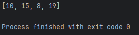
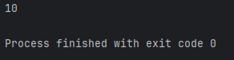
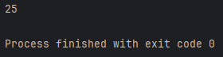
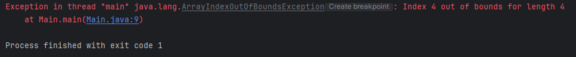
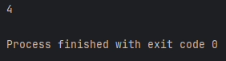
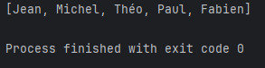
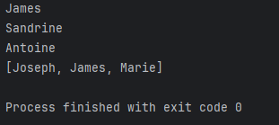
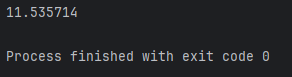

**Les Tableaux en Java**
=============
_Difficultée: 3 / 10 🟢_

-------------

_Dans ce chapitre, nous allons découvrir **qu'est-ce qu'un tableau** en Java, **comment les écrire** et **comment bien s'en servir**._

**C'est Quoi un Tableau ? 🤔**
-------------

-> Par définition, un tableau est une structure de données qui stocke une collection d'éléments du même type, accessibles par un indice numérique.

_Plus simplement, un tableau sert principalement à stocker **un seul type d'élément** pour éviter de créer trop de variables._

-------------

**Comment on écrit des tableaux alors ? 🤔**
-------------

-> Commencez par renseigner **le type de votre tableau**, pour déterminer si vous voulez stocker **uniquement** des valeurs de type **"int", "String", "float"** ou autre. Pour notre exemple j'écris **"int"** pour ne renseigner **que des nombres entiers** dans mon tableau.

``` java
int
```

-------------

-> Ensuite, écrivez deux crochets **"[]"** devant votre valeur pour préciser que vous voulez **écrire un tableau**, **c'est ce préfixe qui permet au tableau de se créer.**

``` java
int[]
```

-------------

-> Écrivez maintenant **le nom de votre tableau**, tout comme une variable le nom doit être **correcte.**

``` java
int[] tableau
```


-------------

-> Assignez ensuite votre tableau à des valeurs en écrivant un **"="** après le nom de votre tableau, puis **des accolades ouvrantes "{" et fermantes "}"** pour ouvrir et fermer votre tableau:

``` java
int[] tableau = {}
```

-------------

-> Pour finir, renseignez vos valeurs **dans les accolades** que vous venez de créer, vous pouvez mettre **autant de valeur que vous souhaitez** à condition que chaque valeur soit **séparé par une virgule ","** et que chaque valeur doit **correspondre au type de votre tableau.**

Vous ne pouvez par exemple pas mettre **"12.56"** dans votre tableau de type **"int".**

``` java
int[] tableau = {10, 15, 8, 19};
```

N'oubliez pas le point-virgule ";".

-------------

° ❌ Il est possible d'afficher le contenu total de votre tableau dans la console, non pas avec cette ligne de code:

``` java
System.out.println(tableau);
```

-> ✅ Mais plutôt avec cette ligne de code:

``` java
System.out.println(Arrays.toString(tableau));

```

Résultat dans la console:



° Il m'affiche bien **10, 15, 8 et 19** le tout **entre crochet**, ce qui signifie bien que **c'est un tableau**.


**Comment j'exploite les données/valeurs de mon tableau ? 🤔**
-------------

° Tout comme dans la plupart des langages de programmation, en Java, il est possible **d'utiliser les données** renseignés dans notre tableau. Pour cela, il est important de comprendre comment sont **rangés les éléments dans ce dernier.**

-> Pour notre exemple, reprenons notre tableau d'avant:

``` java
int[] tableau = {10, 15, 8, 19};
```

Les éléments dans notre tableau sont rangés à une **place bien précise** dans notre tableau aussi appelé **"index".**

🔴 **Le premier élément du tableau sera toujours d'index 0, le deuxième d'index 1, le troisième d'index 2, etc..**

L'index des élements **dépend de là où ils sont placés dans notre tableau**. Prenons notre valeur **"19"**, il est bien à la **4ème place** dans notre tableau, pourtant son index sera de **3**, car l'index commence à **partir de 0**.

_Voici comment marche les index:_

``` java
// Index        [0] [1] [2] [3]
int[] tableau = {10, 15, 8, 19};
```
-------------

-> Si nous voulons afficher **le premier élément** de notre tableau, nous voulons afficher **l'index 0** de notre tableau. 

-> Si nous voulons afficher **le deuxième élément** de notre tableau, nous voulons afficher **l'index 1** de notre tableau.

_Exemple:_

``` java
int[] tableau = {10, 15, 8, 19};

System.out.println(tableau[0]);
```

-> **J'ouvre les crochets** après avoir écrit le **nom de mon tableau** et je renseigne **l'index**, cela m'affichera donc dans la console **l'index 0** de mon tableau de **nom "tableau"**, donc son **premier élément**.

Résultat dans la console:



-> Il m'affiche bien **10** car **l'index 0** de mon tableau est bien **10**.

-------------

° Essayons maintenant d'afficher **la somme** des **deux premiers éléments de notre tableau**, il nous faudra donc **faire la somme** de **l'index 0 et l'index 1**, voilà comment nous pourrions l'écrire:


``` java
int[] tableau = {10, 15, 8, 19};

System.out.println(tableau[0] + tableau[1]);
```

Résultat dans la console:



-> Il m'affiche bien **25** car **25** est **la somme des deux premiers éléments de mon tableau**, soit **10 + 15**.

-------------

🔴 **Attention ! Il n'est pas possible de récupérer une donnée d'un index qui n'existe pas.**

Reprenons notre tableau, nous ne pouvons pas récupérer la valeur de **l'index 4** car elle correspondrait à la **5ème valeur**, qui ici, **n'existe pas**.

``` java
// Index        [0] [1] [2] [3] [4]
int[] tableau = {10, 15, 8, 19};

System.out.println(tableau[4]);
```

Résultat dans la console:



-> On obtient bien une erreur disant que **l'index 4** est **hors du tableau**, ce qui signifie que ce dernier est **inexistant**.

-------------

° Vous faire **ce que vous voulez** avec les données de votre tableau, voici un exemple de code qui **les compare entre eux**, reprenant notre tableau d'origine:

``` java
int[] tableau = {10, 15, 8, 19};

if (tableau[1] == tableau[2]) System.out.println("Les éléments 2 et 3 de notre tableau sont égaux !");    // Je vérifie avec une condition sur l'index 1 et 2 du tableau ont une valeur identique (je compare donc 15 et 8).
else System.out.println("Les éléments 2 et 3 de notre tableau ne sont pas égaux !");
```


**Existe-t-il des fonctions concernant les tableaux ? 🤔**
-------------

-> Oui, il en existe **quelques unes**, ayant chacune une **propriété unique**, les voici:

.length: retourne le nombre d'éléments dans le tableau.
-------

``` java
int[] tableau = {10, 15, 8, 19};

System.out.println(tableau.length);
```

Résultat dans la console:




.split(): divise des éléments et en fait un tableau.
-------

° La fonction **.split()** prend en paramètre une **chaîne de caractère** servant de **séparateur** qui s'applique à une **variable classique**. Elle **découpera les éléments** et les **séparera** grâce à ce que vous entrerez **en paramètre** et vous **créera un tableau avec les données obtenues.**

Exemple:

``` java
String noms = "Jean,Michel,Théo,Paul,Fabien";    // Je crée une variable et non un tableau ayant une seule chaîne de caractère, contenant une liste de prénom séparés par une virgule.
String[] tableau2 = noms.split(",");    // Je crée un tableau de type "String" qui prend la valeur de la variable "noms" (notre liste de prénom) et qui va séparer les éléments à partir de la virgule, comme j'entre une                                            // virgule en entrée.

System.out.println(Arrays.toString(tableau2));
```

Résultat dans la console:




-> Voilà ce qui existe comme **principales fonctions** concernant les tableaux.


**On peut insérer des tableaux dans des tableaux ? 🤔**
-------------

-> Oui, il est possible d'intégrer des tableaux dans des tableaux, pour cela, lors de la déclaration de votre tableau principal (qui va accueillir les autres), vous devez non pas mettre un seul crochet "[]" mais 2 "[][]".
Exemple:


``` java
String[][] tableau = {    // Je crée un tableau qui peut en accueillir d'autre (avec le double crochet).
    {
      "Joseph",
      "James",            // Premier tableau donc première valeur. Index 0 du tableau principal.
      "Marie",      
    },

    {
      "Marion",
      "Olivier",          // Deuxième tableau donc deuxième valeur. Index 1 du tableau principal.
      "Antoine",
    },

    {
      "Sophie",
      "Sandrine",         // Troisième tableau donc deuxième valeur. Index 2 du tableau principal.
      "Max",
    }
};

System.out.println(tableau[0][1]);    // J'affiche le premier tableau (index 0) et l'index 1 de ce tableau, soit son 2ème élément (index 1).
System.out.println(tableau[2][1]);    // J'affiche le troisième tableau (index 2) et l'index 1 de ce tableau, soit son 2ème élément (index 1).
System.out.println(tableau[1][2]);    // J'affiche le deuxième tableau (index 1) et l'index 2 de ce tableau, soit son 3ème élément (index 2).

System.out.println(Arrays.toString(tableau[0]));    // J'affiche la totalité des valeurs de l'index 0, donc j'affiche le premier tableau. 
```


Résultat dans la console:




-------------

° Les tableaux ne se limite pas qu'à **des entiers** ou des **chaînes de caractères**, vous pouvez aller **beaucoup plus loins** que ça, par exemple:


``` java
float[] notes = {17, 5, 10, 8.5f, 7.5f, 18.5f, 14.25f};    // Je crée un tableau de type float (Rappel: Quand on entre une valeur float on met un "f" à la fin de cette dernière).

float moyenne = (notes[0] + notes[1] + notes[2] + notes[3] + notes[4] + notes[5] + notes[6]) / notes.length;  // Je crée une variable "moyenne" qui va additionner toute les valeurs du tableau et va les diviser par le nombre d'élément pour calculer une moyenne.

System.out.println(moyenne);    // J'affiche ma moyenne.
```

Résultat dans la console:



-------------

° Ou alors un tableau représentant les âges de différentes personnes.

```java
byte[] ages = {10, 19, 40};    // Création d'un tableau "ages" de type "bytes" contenant donc que des petites valeurs (Rappel: de -128 à 128).

System.out.println("La personne 1 a " + ages[0] + " ans");    // J'affiche l'âge de la personne 1.
System.out.println("La personne 2 a " + ages[1] + " ans");    // J'affiche l'âge de la personne 2.
System.out.println("La personne 3 a " + ages[2] + " ans");    // J'affiche l'âge de la personne 3.
```

Résultat dans la console:


-------------

Pour plus d'informations, visionnez cette vidéo:  [APPRENDRE LE JAVA #4 - LES TABLEAUX](https://www.youtube.com/watch?v=rvjAPI89QnE&t=396s)

-------------

Voilà, vous avez appris à créer un **tableau** qu'il soit simple ou complexe, entraînez-vous jusqu'à ce que vous maîtrisiez ces derniers pour faire des tableaux encore plus fascinants les uns que les autres !

-> Quizz pour s'exercer: [QUIZZ SUR LES TABLEAUX](https://qruiz.net/Q/?qQry5a)


