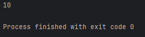

**Les Tableaux en Java**
=============

_Dans ce chapitre, nous allons découvrir **qu'est-ce qu'un tableau** en Java, **comment les écrire** et **comment bien s'en servir**._

**C'est Quoi un Tableau ? 🤔**
-------------

-> Par définition, un tableau est une structure de données qui stocke une collection d'éléments du même type, accessibles par un indice numérique.

_Plus simplement, un tableau sert principalement à stocker **un seul type d'élément** pour éviter de créer trop de variables._

-------------

**Comment on écrit des tableaux alors ? 🤔**
-------------

-> Commencez par renseigner **le type de votre tableau**, pour déterminer si vous voulez stocker **uniquement** des valeurs de type **"int", "String", "float"** ou autre. Pour notre exemple j'écris **"int"** pour ne renseigner **que des nombres entiers** dans mon tableau.

``` java
int
```

-------------

-> Ensuite, écrivez deux crochets **"[]"** devant votre valeur pour préciser que vous voulez **écrire un tableau**, **c'est ce préfixe qui permet au tableau de se créer.**

``` java
int[]
```

-------------

-> Écrivez maintenant **le nom de votre tableau**, tout comme une variable le nom doit être **correcte.**

``` java
int[] tableau
```


-------------

-> Assignez ensuite votre tableau à des valeurs en écrivant un **"="** après le nom de votre tableau, puis **des accolades ouvrantes "{" et fermantes "}"** pour ouvrir et fermer votre tableau:

``` java
int[] tableau = {}
```

-------------

-> Pour finir, renseignez vos valeurs **dans les accolades** que vous venez de créer, vous pouvez mettre **autant de valeur que vous souhaitez** à condition que chaque valeur soit **séparé par une virgule ","** et que chaque valeur doit **correspondre au type de votre tableau.**

Vous ne pouvez par exemple pas mettre **"12.56"** dans votre tableau de type **"int".**

``` java
int[] tableau = {10, 15, 8, 19};
```

N'oubliez pas le point-virgule ";".

-------------

° ❌ Il est possible d'afficher le contenu total de votre tableau dans la console, non pas avec cette ligne de code:

``` java
System.out.println(tableau);
```

-> ✅ Mais plutôt avec cette ligne de code:

``` java
System.out.println(Arrays.toString(tableau));

```

Résultat dans la console:


° Il m'affiche bien **10, 15, 8 et 19** le tout **entre crochet**, ce qui signifie bien que **c'est un tableau**.


**Comment j'exploite les données/valeurs de mon tableau ? 🤔**
-------------

° Tout comme dans la plupart des langages de programmation, en Java, il est possible **d'utiliser les données** renseignés dans notre tableau. Pour cela, il est important de comprendre comment sont **rangés les éléments dans ce dernier.**

-> Pour notre exemple, reprenons notre tableau d'avant:

``` java
int[] tableau = {10, 15, 8, 19};
```

Les éléments dans notre tableau sont rangés à une **place bien précise** dans notre tableau aussi appelé **"index".**

🔴 **Le premier élément du tableau sera toujours d'index 0, le deuxième d'index 1, le troisième d'index 2, etc..**

L'index des élements **dépend de là où ils sont placés dans notre tableau**. Prenons notre valeur **"19"**, il est bien à la **4ème place** dans notre tableau, pourtant son index sera de **3**, car l'index commence à **partir de 0**.

_Voici comment marche les index:_

``` java
// Index        [0] [1] [2] [3]
int[] tableau = {10, 15, 8, 19};
```
-------------

-> Si nous voulons afficher **le premier élément** de notre tableau, nous voulons afficher **l'index 0** de notre tableau. 

-> Si nous voulons afficher **le deuxième élément** de notre tableau, nous voulons afficher **l'index 1** de notre tableau.

_Exemple:_

``` java
int[] tableau = {10, 15, 8, 19};

System.out.println(tableau[0]);
```

-> **J'ouvre les crochets** après avoir écrit le **nom de mon tableau** et je renseigne **l'index**, cela m'affichera donc dans la console **l'index 0** de mon tableau de **nom "tableau"**, donc son **premier élément**.

Résultat dans la console:



-> Il m'affiche bien **10** car **l'index 0** de mon tableau est bien **10**.

-------------

° Essayons maintenant d'afficher **la somme** des **deux premiers éléments de notre tableau**, il nous faudra donc **faire la somme** de **l'index 0 et l'index 1**, voilà comment nous pourrions l'écrire:


``` java
int[] tableau = {10, 15, 8, 19};

System.out.println(tableau[0] + tableau[1]);
```

Résultat dans la console:


-> Il m'affiche bien **25** car **25** est **la somme des deux premiers éléments de mon tableau**, soit **10 + 15**.

-------------

🔴 **Attention ! Il n'est pas possible de récupérer une donnée un index qui n'existe pas.**

Reprenons notre tableau, nous ne pouvons pas récupérer la valeur de **l'index 4** car elle correspondrait à la **5ème valeur**, qui ici, **n'existe pas**.

``` java
// Index        [0] [1] [2] [3] [4]
int[] tableau = {10, 15, 8, 19};

System.out.println(tableau[4]);
```

Résultat dans la console:


-> On obtient bien une erreur disant que **l'index 4** est **hors du tableau**, ce qui signifie que ce dernier est **inexistant**.

-------------
