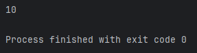
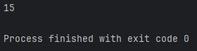
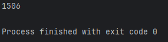
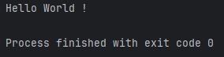

**Les Fonctions**
=============

_Dans ce chapitre, nous allons découvrir **qu'est-ce qu'une fonction** en Java, **comment les écrires** et **comment bien s'en servir**._

**C'est Quoi une Fonction ? 🤔**
-------------

-> Par définition, une fonction est un **bloc de code réutilisable** qui éxécute une tâche spécifique.

_Plus simplement, c'est une sorte de **raccourci** pour tout bon développeur qui se respecte._

-------------

-> Une fonction est un terme général, mais il est possible de l'appeller différement: 

- **Une Méthode** : _Retourne **obligatoirement une valeur** à la fin de cette dernière_.
- **Une Procédure** : _Éxécute **simplement du code** sans un réel retournement de valeur_.

-------------

**Comment on écrit des fonctions alors ? 🤔**
-------------

-> Avant de coder une fonction, posons-nous une question: _"Quel type de valeur doit-je récupérer avec la fonction ? Un Int ? un Booléen ? un String ? Rien ?"._

**Contexte:** Pour notre exemple, nous voulons simplement faire une addition à l'aide de fonction, nous voulons donc récupérer une valeur de type "Int", restons simple.

-------------

Tout d'abord, définissez si votre sera public, private ou protected, pour l'exemple on définira une fonction publique. Je commence donc par écrire "public".

``` java
public
```

Ensuite, renseignez le type de valeur que vous voulez récupérez. Ici, je choisi "int" car je veux récupérer un entier.

``` java
public int
```

Poursuivons notre fonction en écrivant le nom de cette dernière, étant donné que notre exemple est une simple addition, renseignons cela.

``` java
public int addition() {

}
```
_Puis je termine pas des paranthèses collées au nom de notre fonction avec des accolades pour ouvrir et fermer notre fonction, là où nous écrirons notre code tout comme le chapitre sur Les Conditions._

-------------

**🔴 Il est très important de noter que si vous mettez autre chose que "void" dans le type de votre fonction (ici int), vous devrez forcément retourner une valeur de ce type.**

-------------

-> Reprenons notre fonction et ajoutons donc un "return" suivi d'une valeur dîtes "int" car comme mon type de fonction est "int" il me faut donc retourner une valeur de ce type.

``` java
public int addition() {
    return 10;
}
```
On oublie évidemment pas le point-virgule.

-> Dans ce cas présent, si je décide d'utiliser ma fonction dans un calcul ou un affichage, ça m'affichera "10" car je retourne cette valeur.

``` java
public int addition() {
    return 10;
}

System.out.println(addition());
```
Résultat dans la console:



Il m'affiche bien 10.

-------------

Il y a quelque chose d'important à savoir sur les fonctions. Vous pouvez lui ajouter des paramètres ! 
Les paramètres d’une fonction en Java sont des valeurs d’entrée passées à la méthode pour qu’elle puisse effectuer son traitement. Ils permettent de rendre une méthode plus flexible et réutilisable.

Pour cela, revenons dans nos paranthèses de notre fonction et donnons lui un paramètre qu'on appellera "a" pour le premier élément à additionner et un autre "b" pour terminer l'addition, tout les deux de type "int".

``` java
public int addition(int a, int b) {
    return 10;
}

System.out.println(addition(10, 5));
```
On commence d'abord par écrire le type de paramètre, puis son nom, et on peut en rajouter autant que nous voulons à condition qu'ils soient séparés par une virgule, comme ci-dessus.

-> Bien-sûr, si vous ajoutez un paramètre à votre fonction, lors de l'appel de cette dernière vous devez aussi les renseigner, ici, il n'est pas nécéssaire de renseigner le type de valeur mais il faut les séparer par une virgule.

Lors de l'affichage, cela nous affichera encore 10, car nous retournons toujours la valeur "10", nos paramètres ne servent donc à rien actuellement, réglons ça !

-------------

``` java
public int addition(int a, int b) {
    return a + b;
}

System.out.println(addition(10, 5));
```
Je ne retourne plus "10" mais la valeur de "a + b", lors de notre appel de fonction dans le System.out.println(), nos renseignons que a = 10 et b = 5, logiquement, il devrait m'afficher le résultat de 10 + 5:

Résultat dans la console:



-> On peut voir que ça marche bien, il m'affiche bien le résultat des deux paramètres que j'ai entré lors de l'appel de ma fonction, prenons maintenant un autre exemple avec cette fois a = 1500 et b = 6:

``` java
public int addition(int a, int b) {
    return a + b;
}

System.out.println(addition(1500, 6));
```
Résultat dans la console:



-> Voilà, le résultat de notre opération est bien 1500 + 6 = 1506.

-------------
Nous venons de faire une fonction retournant une opération, maintenant, essayons de ne retourner aucune valeur et de simplement afficher "Hello World !" avec une nouvelle fonction.

``` java
public void hello() {
    System.out.println("Hello World !");
}

hello();
```
Résultat dans la console:



-> 


